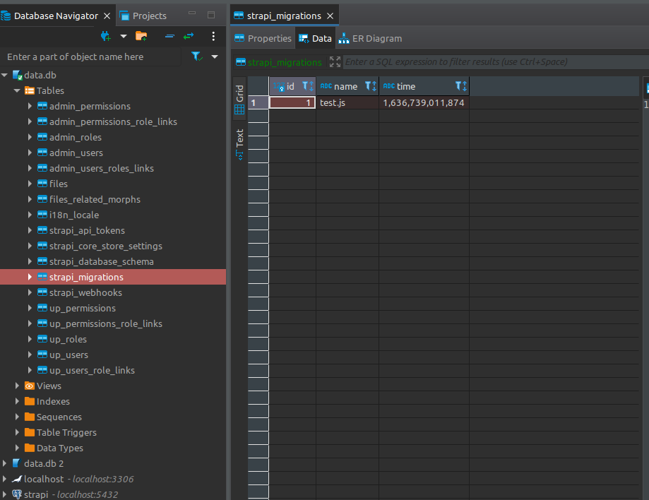

# Manual DB Migrations Example

There is a dedicated folder that will hold your migrations in `./database/migrations/*`

In here you can provide two different types of files:

- anyName.js
- anyName.sql

For the `.js` type here is a basic structure:

```js
module.exports = {
  async up(knex) {
    // Direct access to the Knex.js APIs with an init'ed connection to the database
  }
  async down(knex) {
    // Not implemented yet
  }
}
```

These are read before the auto-sync is handled, however keep in mind that the auto-sync will right now delete any unknown tables (excluding PostGIS tables only atm), indexes, foreign keys, columns, ect.

Also small note that the `.sql` files cannot have comments, I believe this is a bug but will need to talk to the engineers. In this example repo I've suffixed the name with `.example` to make sure it doesn't get ran.

The database will keep a log of the migrations that have been ran as to not try and rerun them again:



We do plan to add more features to this and have the ability to disable the auto-sync, dumping migrations to files to allow you to run them manually and what not.

PR: https://github.com/strapi/strapi/pull/11557

Where these migrations run:

https://github.com/strapi/strapi/blob/2ce6ef7d5b8da000a044346ce8fd5ecfd7a13237/packages/core/database/lib/migrations/index.js#L9-L23

https://github.com/strapi/strapi/blob/2ce6ef7d5b8da000a044346ce8fd5ecfd7a13237/packages/core/database/lib/migrations/index.js#L47-L67
